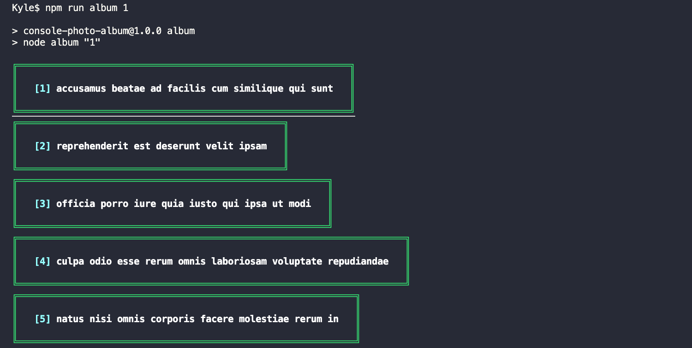

# console-photo-album
A Node.js console app to display photo album data from JSON Placeholder API https://jsonplaceholder.typicode.com/

# Set Up
> Run the following commands from the root of this repository
```
npm i
```
```
npm run album <Album ID (integer between 1 - 100)>
```
```
Example: npm run album 1
```

```
Non Example: npm run album 1a
```


# Testing
> Run the following commands from the root of this repository
```
npm run test
```